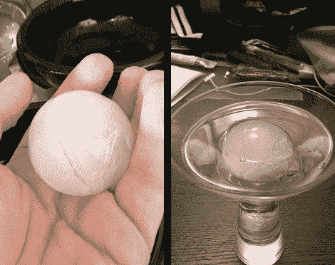

# 为手工鸡尾酒磨冰模具

> 原文：<https://hackaday.com/2012/01/05/milling-ice-molds-for-craft-cocktails/>

下次鸡尾酒会要不要来点冰？你可以尝试寻找球形冰块托盘，但你不会得到这里看到的那种结果。原来这个窍门不是你如何冻结水，而是你如何融化冰。

[Brendan O'Connor]在看到一个可以制作美丽形状而不仅仅是立方体的冰模具后开始了这个项目。但是价格标签是 1400 美元。如果他能在一个黑客空间创造自己的空间，我们打赌那将会支付他一整年的会员费！

这个概念非常简单。休息后的视频显示了他试图重建的模型。这是两大块金属，上面刻有形状。模具被预热，然后一块超大的冰块被放在两块之间。热量融化掉你不想要的部分，在它们之间留下一个完美形状的冰球。当两半模具沿着一些加工好的杆滑动时，重力负责将它们拉在一起。

他用一大块废铝把一个球体磨成两半。如果放在流水下，它们可以被充分加热，当冰球形成时，一些剩余的打印机轨道使两部分保持对齐。现在[布兰登]只需要努力创造一个水晶般透明的冰块作为开始，他将取得全面胜利。

[https://www.youtube.com/embed/cuwJEN3VG-Y?version=3&rel=1&showsearch=0&showinfo=1&iv_load_policy=1&fs=1&hl=en-US&autohide=2&wmode=transparent](https://www.youtube.com/embed/cuwJEN3VG-Y?version=3&rel=1&showsearch=0&showinfo=1&iv_load_policy=1&fs=1&hl=en-US&autohide=2&wmode=transparent)

[通过[扇区 67](http://www.sector67.org/blog/2012/japanese-ice-sphere-mold/)