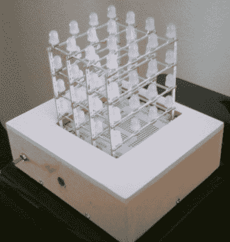

# LED 立方体是一个小套件，需要大量的点对点焊接

> 原文：<https://hackaday.com/2012/01/05/led-cube-is-a-little-bit-of-kit-a-lot-of-point-to-point-soldering/>

[克雷格·林德利]最近完成了自己的 RGB LED 立方体项目。它由四层 4×4 LED 网格组成，但你可能会注意到，支撑这个结构的框架并不是我们所期望的通常的电线网。它们实际上是又长又薄的电路板。为了这个项目，[克雷格]抓住了[Seeed 工作室出售的彩虹魔方套件](http://www.seeedstudio.com/depot/rainbow-cube-kit-rgb-4x4x4-rainbowduino-compatible-p-596.html)。但他没有将它与他们的 Rainbowduino 驱动程序配对，而是建造了自己的驱动程序，以便在如何控制闪光灯方面给他更多的选择。

他使用 Arduino Uno 来控制显示器，选择 TLC5940 驱动芯片来安全地提供点亮电网所需的电力。这些驱动器还提供 12 位脉宽调制，便于颜色混合。直接驱动发光二极管将需要大量这些昂贵的芯片(每片超过 4 美元)，但如果多路复用，该设计只需要两个芯片。

查看一个视频，由于麦克风和放大器电路[Craig]内置在驱动板中，完成的立方体对音乐做出反应。

[https://www.youtube.com/embed/AmR0mKrrqqY?version=3&rel=1&showsearch=0&showinfo=1&iv_load_policy=1&fs=1&hl=en-US&autohide=2&wmode=transparent](https://www.youtube.com/embed/AmR0mKrrqqY?version=3&rel=1&showsearch=0&showinfo=1&iv_load_policy=1&fs=1&hl=en-US&autohide=2&wmode=transparent)