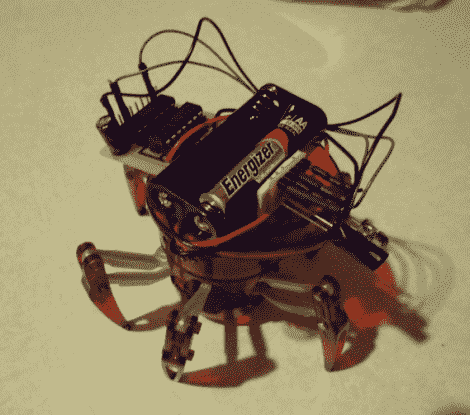

# 让六角蜘蛛可以自由探索

> 原文：<https://hackaday.com/2012/01/05/giving-the-hexbug-spider-freedom-to-explore-on-its-own/>

[Eric Gregori]最近花了一些时间摆弄一只 Hexbug 蜘蛛，[写信来分享他对这个玩具做的一些修改。在其未改变的形式下，机器人可以被远程控制，虽然玩起来很有趣，但兴奋是短暂的。使用 TI MSP430 和他组装的小型电机控制器套件，他给了 Hexbug 更多的个性。](http://buildsmartrobots.ning.com/profiles/blogs/hacking-the-hexbug-tm-spider-with-the-emgrobotics-spider-hack-kit)

该套件实际上只是一个简单的电路板，用于安装 MSP430 和 FAN8200 电机驱动器，以及一对红外发射器/传感器。自己组装类似的东西很容易，但如果你正在寻找一个 protoboard/deadbug/PCB 免蚀刻解决方案，他的 Spider Hack 套件是一个快速简单的解决方案。

[Eric 的]演练显示了如何拆卸 Hexbug，并详细说明了在可以正确安装控制板之前需要更改哪些组件。几根焊接好的电线之后，玩具就可以被重新编程了，这个过程[Eric]使用他用来举起 MSP430 的 Launchpad 板来完成。

正如你在下面的视频中看到的，称机器人为自主可能有点牵强(我没有看到它走到厨房给我做三明治)，但它可以轻松地导航和躲避物体。

 <https://www.youtube.com/embed/SSusgZawFuQ?version=3&rel=1&showsearch=0&showinfo=1&iv_load_policy=1&fs=1&hl=en-US&autohide=2&wmode=transparent>

 <iframe class="youtube-player" width="800" height="480" src="https://www.youtube.com/embed/oTMujZ_CKpE?version=3&amp;rel=1&amp;showsearch=0&amp;showinfo=1&amp;iv_load_policy=1&amp;fs=1&amp;hl=en-US&amp;autohide=2&amp;wmode=transparent" allowfullscreen="true" style="border:0;" sandbox="allow-scripts allow-same-origin allow-popups allow-presentation"/> </body> </html>