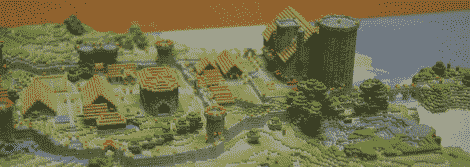

# 3D 打印《我的世界》世界

> 原文：<https://hackaday.com/2012/01/06/3d-printing-minecraft-worlds/>

如果你曾经想要建立一个令人敬畏的桌面游戏或火车模型布局场景，你可能没有比在 RepRap 上打印[《我的世界》世界更好的了。本指南由[Nudel]提供，他知道如何在 RepRap 中使用](http://repraprip.blogspot.com/2012/01/tutorial-printing-from-minecraft-with.html) [Mineways](http://realtimerendering.com/erich/minecraft/public/mineways/) 。虽然[Nudel]的风景[印刷品](http://2.bp.blogspot.com/-ZiWEuemgI6s/TwWJF-DaTsI/AAAAAAAABAM/kHcezj0sw2Y/s400/IMG_8863e.JPG)没有 Shapeways 的色彩，但他只花了 3 美元的材料。如果你想打印出你的服务器的世界，这还不错。

我们不得不为[[Erich 666](http://www.reddit.com/r/Minecraft/comments/nphd1/i_finished_mineways_a_free_program_to_3d_print_or/c3aws0i)]在 Mineways 上的惊人工作而欢呼。他称自己的工作是《我的世界》和 3D 打印机或搅拌机之间的桥梁。休息之后你可以看看[erich]的 Mineways 演示。

当然，如果没有麻省理工学院媒体实验室的两个家伙和 T2·《我的世界》的工作，打印体素的状态就不会有今天。打印()。如果你设法打印出你的基地/城堡/村庄，将其添加到 [Mineways Flickr 群组](http://www.flickr.com/groups/mineways/)。

[https://www.youtube.com/embed/MTAztZjP3ak?version=3&rel=1&showsearch=0&showinfo=1&iv_load_policy=1&fs=1&hl=en-US&autohide=2&wmode=transparent](https://www.youtube.com/embed/MTAztZjP3ak?version=3&rel=1&showsearch=0&showinfo=1&iv_load_policy=1&fs=1&hl=en-US&autohide=2&wmode=transparent)