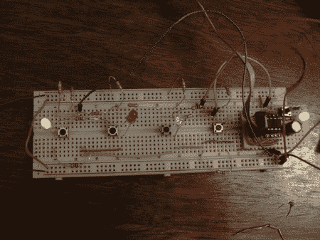

# 一个名叫[诺米斯]的小西蒙克隆人

> 原文：<https://hackaday.com/2012/01/06/a-little-simon-clone-named-nomis/>

[Chris]一直在努力构建他自己版本的 Simon，名为[[Nomis]](http://happyrobotlabs.com/posts/project/nomis-a-simon-clone-for-the-attiny85/)。虽然[HAD]以前曾报道过一个 T2·阿蒂尼·西蒙的克隆人，但这篇文章在解释这个系统如何工作方面做得很好。

ATTiny85 用于控制这款游戏，目前它被放置在一个简单的试验板上。这款游戏的 PCB 版本已经从[【Seeed】](http://www.seeedstudio.com/depot/)订购，所以一定要回来看看这次即将到来的升级的结果。这种小规模制造能为大众所用，这真的很酷。

提供了零件清单以及代码概述和原理图。要查看它的运行情况，请在休息后观看视频。开头有一个解释，但是如果你想看机器运转的话，可以跳到 1:55。据报道，该游戏可以运行到 100“移动”的限制。这是武断的，但对大多数人来说应该足够了！ <https://www.youtube.com/embed/NM2AbkHqHag?version=3&rel=1&showsearch=0&showinfo=1&iv_load_policy=1&fs=1&hl=en-US&autohide=2&wmode=transparent>

 </body> </html>