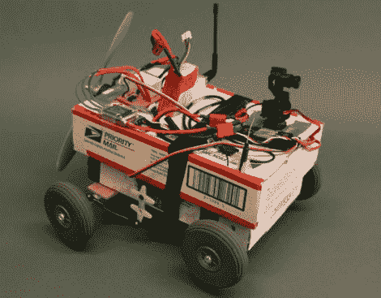

# 好吧，你可能不是偏执狂——也许那个优先邮箱正在监视你

> 原文：<https://hackaday.com/2012/01/06/ok-you-might-not-be-paranoid-perhaps-that-priority-mail-box-is-spying-on-you/>

[Thomas Renck]最近获得了一个 1000mW 无线视频发射器，他最终计划将其安装在一架钢筋混凝土飞机上。在他把它绑在飞机上准备永远和它吻别之前，他想玩一会儿，看看它能做什么。

在一个朋友帮助他确定了相机的最大范围(在开阔地上大约 1900 英尺)后，他认为将它绑在他的硝基 R/C 卡车上会很有趣。由于一些振动问题，这并没有很好地工作，所以他用相机到达的装运箱，以及其他一些零碎东西建造了一个临时的遥控汽车。

正如你在下面的视频中所看到的，螺旋桨驱动的“盒子移动”非常漂亮。来自摄像头的视频也非常令人印象深刻，让他可以在看不见的情况下轻松引导汽车。

近 350 美元，自称“贫民窟机器人”当然不便宜，虽然我们听说身体修复是小菜一碟！

 <https://www.youtube.com/embed/_c9TwUDyedg?version=3&rel=1&showsearch=0&showinfo=1&iv_load_policy=1&fs=1&hl=en-US&autohide=2&wmode=transparent>

 </body> </html>