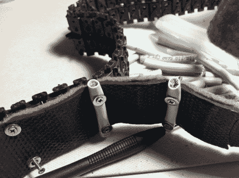

# 改进用于爬楼梯的螺纹机器人

> 原文：<https://hackaday.com/2012/01/06/treaded-robot-modified-for-stair-climbing/>

[李丁山]正在展示他的爬楼梯机器人。这是一个靠一对坦克履带行走的机器人，但一些有趣的修改给了他爬楼梯而不向后滑动所需的牵引力。

上图详细展示了这一过程。你可以看到未改变的胎面离开图像的顶部。前景中，橡胶背衬的地毯条为原本光滑的表面增加了一些粘性。为了真正阻止机器人滑动，CAT5 电缆的一部分被固定在踏板上，在这个过程中紧紧抓住地毯。

你可以在休息后的视频中看到，小机器人在崎岖的地形上没有问题。这个设计的灵感来自 iRobot pack bot,它有一组伸出前端的踏板附件。这些确保了障碍物的垂直面，例如楼梯的起点，仍然可以被主踏板到达。

 <https://www.youtube.com/embed/Ktw6AZU2Wtk?version=3&rel=1&showsearch=0&showinfo=1&iv_load_policy=1&fs=1&hl=en-US&autohide=2&wmode=transparent>

 </body> </html>