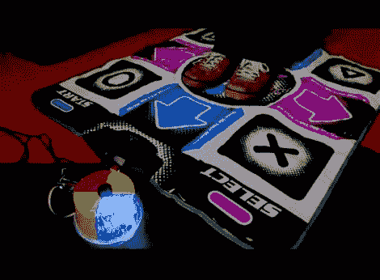

# [亚历克斯]向我们展示了当跳舞革命遇到西蒙时会发生什么

> 原文：<https://hackaday.com/2012/01/08/alex-shows-us-what-happens-when-dance-dance-revolution-meets-simon/>

[亚历克斯]是通过他的衣柜挖掘，偶然发现了一个旧的 PS2 游戏垫的舞蹈舞蹈革命。比起再次玩 DDR，他更讨厌扔掉它的想法，所以他决定找到一种重新使用它的方法。

他小时候是游戏《西蒙》(又名《天才》)的忠实粉丝，并认为 DDR pad 将为这款经典游戏打造一个新颖的界面。使用[比尔·波特]的 PS2XLib，Arduino 可以轻松地与 PS2 控制器通信，[亚历克斯]很快就将他的西蒙复制品组装起来。

他用经典的西蒙颜色画了一个空的冰淇淋容器，在每个象限下面安装了一个小 LED，然后编写了游戏代码。

正如你在下面的视频中看到的，他的游戏版本工作得很好，迫使你实际上站起来移动一点，这是我们喜欢的。

[https://www.youtube.com/embed/OFKyOM7JNfY?version=3&rel=1&showsearch=0&showinfo=1&iv_load_policy=1&fs=1&hl=en-US&autohide=2&wmode=transparent](https://www.youtube.com/embed/OFKyOM7JNfY?version=3&rel=1&showsearch=0&showinfo=1&iv_load_policy=1&fs=1&hl=en-US&autohide=2&wmode=transparent)