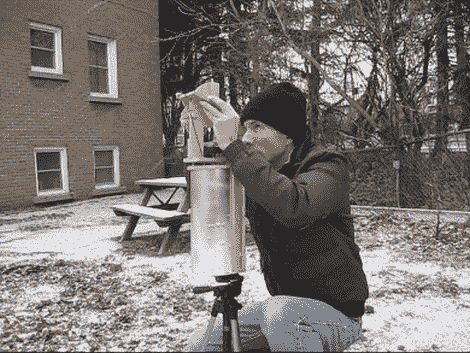

# DIY 遮荫寻找工具带出了太阳能调查的单调

> 原文：<https://hackaday.com/2012/01/08/diy-shade-finder-tool-takes-the-tedium-out-of-solar-surveys/>

[Steven Dufresne]对太阳能应用做了很多修补，如果做得好，这是一个非常耗时的爱好。每当建造一个太阳能装置时，他都会执行的一个过程是[创建一个太阳图](http://rimstar.org/renewnrg/solar_site_survey_DIY_shade_finder_tool.htm)来确定目标区域将获得多少(或少)太阳。

这个过程需要[Steven]对许多不同的点进行高度和方位测量，这通常要花费他大约半个小时的时间。在最近进行测量时，他开始思考如何改进流程，并提出了一个出色的解决方案，将流程缩短为一分钟的任务。

简而言之，他的 shade finder 工具使用一个滑轮、一对直排轮和一支铅笔在不到一分钟的时间内完成一次完整的阴影测量。该工具背后的科学由[Steven]作了最好的解释，所以一定要查看他的站点以获得大量的细节和图表。

我们不得不说，他的遮荫探测器给我们留下了极其深刻的印象——希望他的工作能够帮助其他人最大限度地提高他们太阳能解决方案的效率。

跳完之后留下来看一小段视频。

 <https://www.youtube.com/embed/44NAXcA22Mg?version=3&rel=1&showsearch=0&showinfo=1&iv_load_policy=1&fs=1&hl=en-US&autohide=2&wmode=transparent>

 </body> </html>