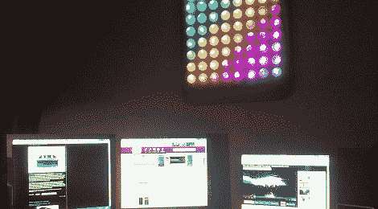

# 许多乒乓球的彩虹板

> 原文：<https://hackaday.com/2012/01/08/rainbow-board-of-many-ping-pong-balls/>

[George]刚刚完成了他的第一个项目:一个 8×8 矩阵"[板，由许多乒乓球](http://dashroom66.org/2012/01/the-board-of-many-ping-pong-balls/)和 64 个 RGB LEDs 组成。他在 14 岁时就开始了这个项目，并在去年圣诞节假期完成了建造。我们不会对[乔治]的年龄做任何推测，但我们想不出一个更好的项目来开始。

为了建造，[乔治]为他的 Arduino 使用了一个 [Colorduino](http://www.micro4you.com/store/colorduino.html) LED 驱动盾。这使得布线简单，但成品是这个项目真正的亮点。对于底座，[乔治]在他的学校得到了一个激光切割板，并用乒乓球来分散 led。我们已经看过这个[很多次](http://hackaday.com/2011/12/30/build-your-own-mini-ball-drop-for-new-years-eve/) [次](http://hackaday.com/2011/01/31/how-to-build-a-ping-pong-ball-display/)但是有了这个构造，就有了一个在乒乓球上钻孔的简洁方法；简单地把钻头倒转过来。摩擦力足以打开球，塑料碎片会出来而不是留在里面。

我们对[乔治]和他的寒假项目印象深刻。他足够幸运，在学校可以使用激光切割机，从他的显示器上看，他正在阅读正确的网站。休息之后你可以看看他的彩虹图案。

 <https://www.youtube.com/embed/m41S2sZquC4?version=3&rel=1&showsearch=0&showinfo=1&iv_load_policy=1&fs=1&hl=en-US&autohide=2&wmode=transparent>

 </body> </html>