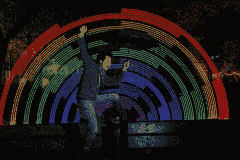

# 彩虹机让任何照片变得生动

> 原文：<https://hackaday.com/2012/01/09/rainbow-machine-livens-up-any-photograph/>

[沙梅尔·阿拉芬、肖恩·麦金太尔和里德·宾汉姆]真正挖掘彩虹。三人组以“RainBroz”的名字建造了一个便携式显示器，可以用来给图片添加酷炫的光绘效果。

这个小组带着他们的彩虹机器到处跑，包括聚会、聚会和街道上的随机地点。任何人都可以用彩虹机拍照，每个人都会得到一张上面有网址的卡片，这样他们就可以随时查看他们的照片。

该显示器由可寻址的 RGB LED 条和 Adafruit 的 Arduino 组成，以及用于移动 LED 的相关支撑机构。真正的魔法是由同样来自 Adafruit 的 LPD8806 光画库实现的，它使 RainBroz 能够毫不费力地创建各种图像。

正如你在下面的视频中看到的，彩虹机似乎受到了几乎所有人的热烈欢迎，甚至是从街上抓来的人。建造看起来很简单，为什么不在下次聚会时组装一个呢？

[vimeo http://vimeo.com/31735737 w=470]