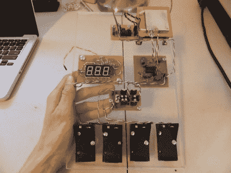

# 为科学奥林匹克竞赛建造的盐度计

> 原文：<https://hackaday.com/2012/01/09/a-salinometer-built-for-the-science-olympiad/>

这是一个数字盐度计，丹尼尔·克拉姆尼克建造它作为科学奥林匹克竞赛的参赛作品。他是一名高三学生，在寻找参加水质活动的项目时，他对获得比机械比重计更高的准确度感兴趣。

我们认为电路设计对于任何没有完成正式工程师培训的人来说都是非常令人印象深刻的，对于像丹尼尔这样年轻的人来说更是如此。测量依赖于两个主要部分，温度控制和盐度传感器。这两者都是必要的，因为样品温度的波动会影响盐度读数。

如果水样不在设定的温度范围内，帕尔贴元件用于加热水样。然后，运算放大器电路对流经样本的信号进行调理，将输出传递给 ADC 转换器芯片，后者驱动三位数读数。[丹尼尔]计算精度在 0.0014%以内。他一定很得意，因为他赢得了地区比赛，不久将参加州级比赛。