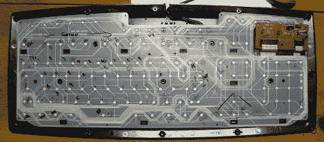

# 黑客帝国重装上阵:现在比电影更好

> 原文：<https://hackaday.com/2012/01/09/the-matrix-reloaded-now-better-than-the-movie/>

如果你正在寻找一个定制的 MAME 橱柜控制器，数控机床，或者只是想控制一个机器人，你需要连接一些按钮。你可以把一堆按钮连接到一个微控制器上，但是如果你使用一个旧的电脑键盘，这项工作已经为你完成了。

[Rupert]发了一个关于重新利用旧键盘的很棒的教程。构建非常非常简单:只需用万用表测量每个触点的行和列的连续性。一旦[鲁伯特]有了键盘上每个按钮的矩阵代码，他就把一段带状电缆连接到键盘的印刷电路板上。从那里，一个小的分线板提供了 MAME 橱柜需要的所有连接。

与定制的键盘编码器如 I-PAC 或自制的解决方案不同，[鲁伯特]的构建非常简单，只需要在垃圾箱里寻找键盘就可以了。