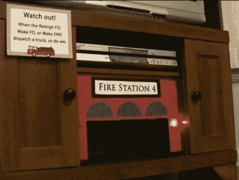

# 火柴盒发射器对紧急波段无线电调度员做出反应

> 原文：<https://hackaday.com/2012/01/11/matchbox-launcher-reacts-to-emergency-band-radio-dispatcher/>

[杰夫]和他的妻子为他们的儿子举办了一个消防员主题的生日庆祝活动。由于他在厨房里不太得心应手，[杰夫]决定不帮忙烘烤或装饰蛋糕。但是他没有放弃将几个不同的项目结合起来制造一个能够响应紧急波段无线电的火柴盒汽车发射器的机会。

由于他是一个业余无线电爱好者，他已经有了一台扫描仪来监测电波。显然有一个波段专门用于向紧急车辆传递调度信息。他把无线电设备设置成只监听那个频道。一个 Arduino 被添加到混音中，测量扫描仪音频输出的电压水平。当它开得足够高时，Arduino 就会触发玩具车发射器。

汽车发射器本身是一个非常漂亮的设置。一个斜坡的顶部有五个滑槽，每个适合一辆汽车。滑动门将它们固定在适当的位置，但是可以通过齿轮马达一次移动一个槽。海报板正面和两个闪烁的红色发光二极管的添加使该设置与其他派对装饰品看起来很像。

在广告之后的剪辑中看到一个电话打进了电台。我们没有一个叫做“快乐育儿”的类别，所以只能用“玩具黑客”了。