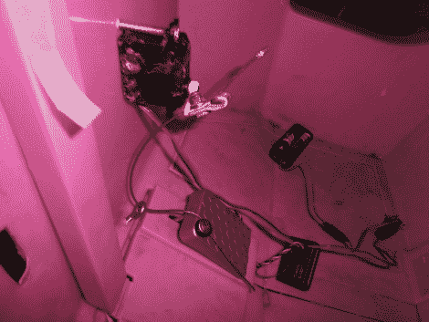

# 电动轮吉普车是一辆很棒的遥控车

> 原文：<https://hackaday.com/2012/01/11/power-wheels-jeep-makes-an-awesome-rc-car/>

来自 RevoltLab 的[Will]来信分享了他现在正在做的一个很酷的项目的第一部分，一个遥控移动火箭发射器。在你跑去打电话给国土安全部之前，他说这个发射器将用于个人爱好火箭，这通常被认为是无害的。

建造的第一部分主要是获得一辆电动轮汽车，并对其进行改装，使其可以远程驾驶。在从 Craigslist 上找到的一辆芭比吉普车上拆下大部分零零碎碎的东西后，他在仪表板下添加了一个小的业余爱好伺服系统来驱动踏板。吉普车的转向杆上安装了一个更大(也更贵)的伺服系统，让[威尔]轻轻一按开关就能轻松转动车轮。

随着机械部件的拆除，他安装了一个遥控接收器，带着他的发明走上了~~街道~~草坪。

这辆车看起来操控很好，尽管零部件的价格很快开始上涨，我们还是很乐意花那么多钱买一辆那么大的遥控车！

继续阅读，观看吉普车在行动中的简短视频，并确保经常检查反抗实验室的网站，以跟踪[威尔]的进展。

 <https://www.youtube.com/embed/Zo1ZkT5C5u0?version=3&rel=1&showsearch=0&showinfo=1&iv_load_policy=1&fs=1&hl=en-US&autohide=2&wmode=transparent>

 </body> </html>