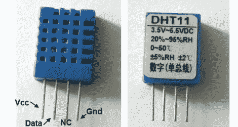

# DHT11 湿度和温度传感器封装

> 原文：<https://hackaday.com/2012/01/11/dht11-humidity-and-temperature-sensor-package/>

温度和湿度测量是对许多爱好项目的一个很好的补充。但是[Rajendra Bhatt]指出，这些传感器的价格远远高于大多数爱好者愿意花费的价格。他决定对 DHT11 传感器进行深入研究；如果你知道去哪里找，不到 3 美元就能买到。

四引脚设备使用单线协议。[Rajendra]讨论了通信的来龙去脉，并使用 PIC 16F628 演示了器件。连接到您的项目非常容易，只需在单条数据线上连接 VCC、GND 和一个上拉电阻。我们已经看到它在至少一个项目中使用[，并希望在你们自己的 hacks 中看到更多这个小家伙。](http://hackaday.com/2012/01/04/over-engineering-a-two-zone-thermometer/)

现在，我们发现这个零件在易贝上市的价格不到 3 美元(立即购买价格包括运费…他们怎么能这样做？).但是 Octopart 没有提出任何选项。如果你知道如何通过传统的零件供应商来得到它，请在评论中告诉我们。