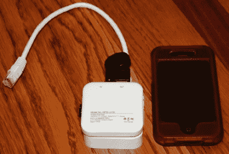

# 用于笔测试或其他的廉价 WiFi 桥

> 原文：<https://hackaday.com/2012/01/12/cheap-wifi-bridge-for-pen-testing-or-otherwise/>

二十三美元。这就是全部[这个小小的笔测试设备](http://www.minipwner.com/index.php/what-is-the-minipwner)会让你陷入困境。其实没什么大不了的。[Kevin Bong]想出了用 Wifi 路由器作为桥梁来远程测试有线网络安全性的主意。他抢了一个 TP-Link TL-WR703N 路由器、一个低调的拇指驱动器和一个手机备用电池；所有便宜的产品。

连接这三个组件不需要硬件入侵。唯一需要做的其他准备就是用 OpenWRT 刷新路由器固件，并用 Netcrack 和 Airhack 等常见的笔式测试软件包加载它。

[Kevin]称之为投件箱，因为你找到一个以太网插孔，插上它，然后把它放在那里。然后，您可以通过 Wifi 连接到路由器，并开始测试有线网络安全措施。我们确信，从那个描述中，间谍活动的画面会跃入你的脑海，但我们确信这在其他方面也是有用的。如果你发现自己有以太网连接，但无法访问 Wifi，这是一个快速设置 AP 的方法。