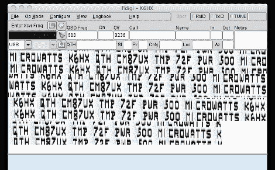

# Hellduino:来自 Arduino 板的 Hellschreiber 无线电传输

> 原文：<https://hackaday.com/2012/01/12/hellduino-hellschreiber-radio-transmissions-from-an-arduino-board/>

[Mark VandeWettering]正在试验一个简单的传输电路和一个 Arduino。这个项目中的电路是由史蒂夫·韦伯设计的，使用莫尔斯电码来广播温度和遥测数据。但是[Mark]想要超越那个协议，开始写一个使用 Hellschreiber 协议广播的草图。

这个协议传输字形图像，如你上面看到的那样解码。出于某种原因，我们不禁认为这就像是无线电爱好者的验证码。我们之前已经见过与 AVR 微控制器一起使用的 [Hellschreiber，但这是我们遇到的第一个 Arduino 实现。[Mark]在休息后的视频中出色地展示了他的项目。他提到发射器没有天线，但仍能被安装在他房子后面的接收天线接收到。](http://hackaday.com/2011/08/08/scott-made-a-single-chip-hellschreiber-on-earth/)

由于[Mark]没有真正涵盖他所使用的硬件，您需要回头查看[Steve]的[原始设计原理图](http://kd1jv.qrpradio.com/temp2morse/temp2morse.htm)以了解更多信息。

[https://www.youtube.com/embed/uHsZRqrMdH0?version=3&rel=1&showsearch=0&showinfo=1&iv_load_policy=1&fs=1&hl=en-US&autohide=2&wmode=transparent](https://www.youtube.com/embed/uHsZRqrMdH0?version=3&rel=1&showsearch=0&showinfo=1&iv_load_policy=1&fs=1&hl=en-US&autohide=2&wmode=transparent)

[感谢玩具制造商电视]