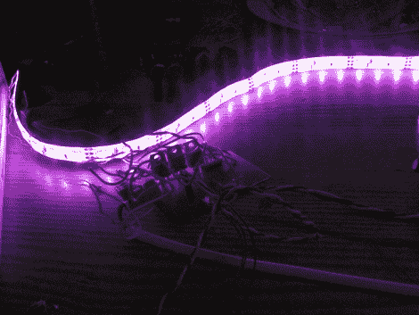

# 工具箱调光器帮助朋友，提供设计技巧

> 原文：<https://hackaday.com/2012/01/13/tool-box-light-dimmer-helps-out-a-friend-offers-up-design-tips/>

[miceuz]有一个朋友是戏剧技师，在工作过程中，他经常需要在演出过程中晃动各种舞台组件。可以想象，照明情况远非理想，因此[他要求【miceuz】为他的工具箱打造一个可调节的照明解决方案](http://blog.hardcore.lt/mic/archives/011037.html)。

电路本身相对简单，使用 ATMega88 提供调光和颜色控制所需的 PWM。输入来自三个不同的来源，一个用于颜色选择的旋转编码器，一个用于亮度控制的锅，以及一个用于打开和关闭光带的按钮。

[miceuz]说，虽然这个项目很容易就完成了，但它仍然存在一些问题，为初学者(和一些老手)提供了一些有用的设计提醒。

首当其冲:[去抖，去抖，去抖。](http://hackaday.com/page/1/?s=debounce)【mice uz】忘记了这句口头禅，在蚀刻 PCB 后疯狂地在设计中添加电容，以确保他的输入不会到处跳动。他还指出，解码 ADC 数据时，应始终确保先读取 ADCL，再读取 ADCH 寄存器。他的最后观察是，尽可能使用厚走线是最好的策略——他在组装过程中遇到了很多走线分离的问题，他不得不使用导线和焊料进行返工。

最后，他的朋友对结果很满意，而且[miceuz]因为解决了他的问题而成为一个更好的黑客。在你的项目过程中，你学到了哪些重要/有用的经验？请务必在评论中与我们分享。