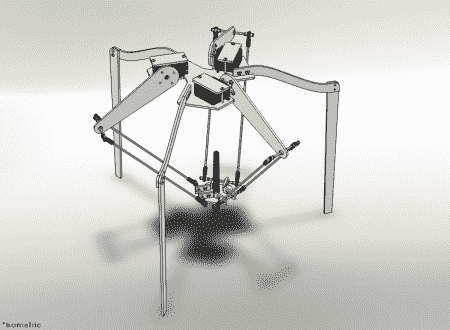

# [毕达哥拉斯]，一个用于绘图的 Delta 机器人

> 原文：<https://hackaday.com/2012/01/13/pythagoras-a-delta-robot-for-drawing/>

[【毕达哥拉斯】](http://aaronbot3000.blogspot.com/p/pythagoras.html)是最初使用 RC 伺服系统建造的 delta 机器人。谦逊地，[亚伦]“承认”他的第一个版本的三角洲机器人使用业余爱好伺服很容易建立。正如任何制造过任何一种机器人的人都知道的那样，即使是最简单的机器人也肯定有很多工作要做。协调三个轴，并编程让它画一幅画，这真的是一项伟大的成就。

然而，第二个版本目前正在开发中，使用步进电机代替伺服电机。这些升级的马达应该会让机器人更快、更可控、更精确。这个版本至少在一定程度上是可行的，休息后的延时视频就是证明。

虽然上面列出的标题页在构建细节上有点稀疏，但如果你更深入地挖掘页面，实际上有 15 篇关于“机器人”的文章，所以一定要四处看看。

[https://www.youtube.com/embed/TxmmQhV0KS0?version=3&rel=1&showsearch=0&showinfo=1&iv_load_policy=1&fs=1&hl=en-US&autohide=2&wmode=transparent](https://www.youtube.com/embed/TxmmQhV0KS0?version=3&rel=1&showsearch=0&showinfo=1&iv_load_policy=1&fs=1&hl=en-US&autohide=2&wmode=transparent)

如果你对 delta 机器人还不够感兴趣，一定要看看这篇关于由 Kinect 控制的 delta 机器人的文章，或者尝试一下 T2 的 3D 打印 delta 机器人！