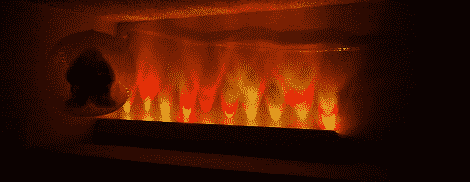

# 用最简单的方法制作 LED 灯条

> 原文：<https://hackaday.com/2012/01/13/building-a-led-strip-the-minimal-way/>

对于他的第一个大型 MSP430，Javon 决定使用 RGB LED 推子。过去曾与 Arduinos 合作过，他认为[他的 MSP430](http://www.ti.com/product/msp430g2231) 应该有几个 PWM 通道。在被数据手册证明是错误的之后，[Javon]需要找到一种方法，在他的微控制器上只用一个 PWM 通道来切换一束 RGB LEDs。

因为[Javon]的微处理器上只有一个 PWM 引脚，所以他需要一种方法来多路复用他的输出。他最终使用 74HC4052 mux/demux 芯片来驱动 20 个 led。led 安装在硬纸板上，电路的主要部分建立在一点 perfboard 上。虽然没有他的构建的总成本，我们猜测[Javon]没有在他的项目上花费太多；确定性远不如这次[led](http://hackaday.com/2011/12/26/stripinvaders-puts-colored-lights-everywhere/)爆炸。

[Javon]把所有的构建图片作为一个 Google+相册放上去，还有一些视频演示。休息后看看这些(009 音响系统警告，你可能想按静音)。

 <https://www.youtube.com/embed/ekaUpoXU6PE?version=3&rel=1&showsearch=0&showinfo=1&iv_load_policy=1&fs=1&hl=en-US&autohide=2&wmode=transparent>

 <iframe class="youtube-player" width="800" height="480" src="https://www.youtube.com/embed/mGdunfZSGEA?version=3&amp;rel=1&amp;showsearch=0&amp;showinfo=1&amp;iv_load_policy=1&amp;fs=1&amp;hl=en-US&amp;autohide=2&amp;wmode=transparent" allowfullscreen="true" style="border:0;" sandbox="allow-scripts allow-same-origin allow-popups allow-presentation"/> <iframe class="youtube-player" width="800" height="480" src="https://www.youtube.com/embed/iW8AYSsaDHA?version=3&amp;rel=1&amp;showsearch=0&amp;showinfo=1&amp;iv_load_policy=1&amp;fs=1&amp;hl=en-US&amp;autohide=2&amp;wmode=transparent" allowfullscreen="true" style="border:0;" sandbox="allow-scripts allow-same-origin allow-popups allow-presentation"/> </body> </html>