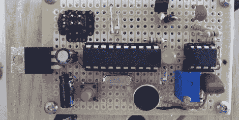

# DIY 可调光拍板，满足你所有慵懒的照明需求

> 原文：<https://hackaday.com/2012/01/15/diy-dimmable-clapper-for-all-your-lazy-lighting-needs/>

对于懒得买瓦数合适的灯的懒人来说，这里有一个聪明的铃锤，它最终有能力调暗灯光。

和我们上个月看到的拍板一样，【Pete】的版本使用了 ATtiny2313 和驻极体麦克风。使[皮特]的版本与 80 年代的老款不同的是调暗灯光的能力。像任何拍板一样，一秒钟内的两次拍手会触发继电器。在一秒钟内拍手三次会使灯进入渐暗模式。在这种模式下，灯通过 PWM 变暗和变暗，直到检测到第四次拍手声。

[Pete]发现他的 ATtiny2313 中的程序内存没有 100%满，所以他增加了一些功能。如果你用激光照射他的电路，继电器就会跳闸并打开一个装饰性的月亮灯。还有一种“演讲模式”，将麦克风直接送入微控制器，以改变 PWM 信号。结果是光线变得更加明亮，声音更加强烈。在[Pete]的聪明拍板的演示视频之后，休息一下，看看这个特性。

 <https://www.youtube.com/embed/kaP7LGRPf_I?version=3&rel=1&showsearch=0&showinfo=1&iv_load_policy=1&fs=1&hl=en-US&autohide=2&wmode=transparent>

 <iframe class="youtube-player" width="800" height="480" src="https://www.youtube.com/embed/A7XXPJOxyOs?version=3&amp;rel=1&amp;showsearch=0&amp;showinfo=1&amp;iv_load_policy=1&amp;fs=1&amp;hl=en-US&amp;autohide=2&amp;wmode=transparent" allowfullscreen="true" style="border:0;" sandbox="allow-scripts allow-same-origin allow-popups allow-presentation"/> </body> </html>