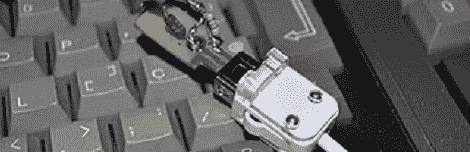

# 80 年代电脑上的 Wii 双截棍

> 原文：<https://hackaday.com/2012/01/16/wii-nunchuck-on-an-80s-computer/>

对于一台 80 年代初推出的电脑来说，MSX 是一台非常值得尊敬的机器。当然，在那些日子里，在视频上叠加图形是一个惊人的壮举，但[Danjovic]和[Igor]仍然对他们的 boxen 很感兴趣。他们在他们信赖的 MSX 电脑上为 Wii 双截棍设计了一个软件界面。

标准 Wiimote 后面的插头就是一个简单的 I2C 总线。用这个端口可以做很多事情，从[插上古代控制器](http://hackaday.com/2011/09/19/using-classic-game-controllers-with-a-wii/)到[控制机器人](http://hackaday.com/2011/07/28/security-bot-2/)。[Danjovic]和[Igor]设法用 Basic 编写了一个例程,将来自双截棍的 I2C 数据转换成 MSX 可以理解的数据，而无需对硬件做任何修改。

将双截棍插入 MSX 所需要的只是一个分压器，以及计算机和控制器之间的几个上拉电阻。他们从两个按钮、操纵杆和双节棍中的加速度计获得数据，并编写了一个小程序，在屏幕上显示一些精灵来演示这一点。休息之后请继续关注。

[https://www.youtube.com/embed/RNiMxM2kduk?version=3&rel=1&showsearch=0&showinfo=1&iv_load_policy=1&fs=1&hl=en-US&autohide=2&wmode=transparent](https://www.youtube.com/embed/RNiMxM2kduk?version=3&rel=1&showsearch=0&showinfo=1&iv_load_policy=1&fs=1&hl=en-US&autohide=2&wmode=transparent) [https://www.youtube.com/embed/w0B2zOgL6-U?version=3&rel=1&showsearch=0&showinfo=1&iv_load_policy=1&fs=1&hl=en-US&autohide=2&wmode=transparent](https://www.youtube.com/embed/w0B2zOgL6-U?version=3&rel=1&showsearch=0&showinfo=1&iv_load_policy=1&fs=1&hl=en-US&autohide=2&wmode=transparent)