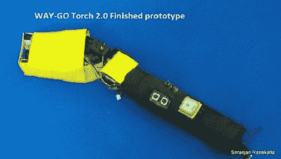

# 智能手电筒会给你指路

> 原文：<https://hackaday.com/2012/01/16/intelligent-flashlight-will-literally-show-you-the-way/>

手电筒太 20 世纪了。无论是很早就出现的白炽灯，还是 90 年代出现的 LED 型号，这些设备都没有多少令人兴奋的地方。但是[Sriranjan Rasakatla]正在尽最大努力改变这种状况。这是他的随身手电筒，一个智能手电筒？)这不仅会照亮你的道路，还会在上面覆盖有用的数据。

在该装置的前面，一个微型投影仪安装在一个组合组件上。这使得设备可以将数据投射到你面前的地面上。使用数字指南针和 GPS 模块，它可以显示极坐标，为您指路，或提供您周围建筑物的信息。机动安装提供基于 IMU 数据的图像稳定。休息后请观看演示视频。它在剪辑的第一部分显示了一般功能，在 4:30 左右有一些稳定系统的镜头。

这看起来真的像是出自科幻小说。这很有用，但是它的复杂性让[Sriranjan]能够做到这一点令人惊讶。我们想知道这款设备的电池寿命如何，但它不可能比那些真正巨大的手电筒中的一个更糟糕了。

 <https://www.youtube.com/embed/tQ6eIi7YTv0?version=3&rel=1&showsearch=0&showinfo=1&iv_load_policy=1&fs=1&hl=en-US&autohide=2&wmode=transparent>

 </body> </html>