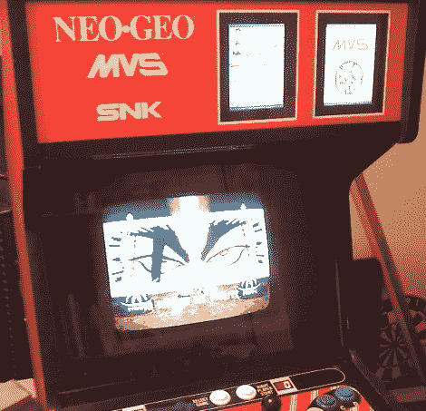

# 向 Neo Geo 街机机柜添加数字游戏指示器

> 原文：<https://hackaday.com/2012/01/19/adding-digital-game-indicators-to-a-neo-geo-arcade-cabinet/>

[乔治]是一个近地天体爱好者，在他的随身物品收藏中，他有一个 MVS 迷你游戏机。他的迷你“多视频系统”是一个 2 插槽型号，这意味着它一次可以容纳两个游戏盒，这由插在机柜面板上的塑料卡来指示。他认为安装数字显示器会更酷，而不是每次更换墨盒时都要更换这些卡。

他几乎找遍了所有能找到的零售店，才找到了几个看上去符合要求的 5 英寸小数码相框。在对橱柜进行了一些仔细的改装后，他将它们连接起来，准备展示。这些相框不能容纳太多的照片，但它们支持 SD 卡的使用。[George]说他可能会买一大堆小 SD 卡，每当他改变游戏时就把它们换出来，尽管随着时间的推移，这可能会变得像换塑料卡一样乏味。

我们很想看到[乔治]把他的新数字显示器提升一个层次，所以一定要在评论中分享你的想法。也许我们可以说服他把事情自动化一点。