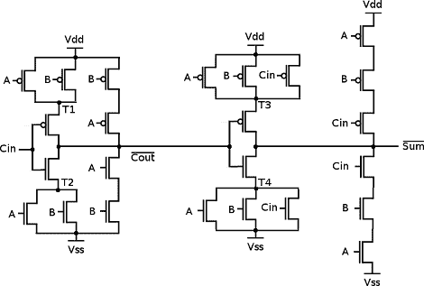

# 使用命令行计算

> 原文：<https://hackaday.com/2012/01/20/computing-with-the-command-line/>

这里有一些我们认为永远不会看到的东西:只用[管道、/dev/zero 和/dev/null](http://www.linusakesson.net/programming/pipelogic/index.php) 进行计算。

作为一个思想实验，[Linus]设想一个空字节代表一个电子。/dev/zero 将有无限的电子供应，而/dev/null 将是一个极好的正电源。通过一个非常短的程序(名为 mosfet.c)，[Linus]可以使用 Linux 管道来控制/零和/null 之间的电子流。[Linus]使用 mosfet.c 和一个非常短的 shell 脚本创建了一个与非门。从那以后，所有的赌注都取消了。他最终创造了一个 D 触发器、 [4 位加法器](http://en.wikipedia.org/wiki/Full_adder#Full_adder)和一个计数器。

根据粗略的研究，Linux 的最大管道容量为 1，048，576 字节，最大 PID 数量为 4，194，304(如果我们错了，请纠正我们)。[Linus]理论上可以用他的管道逻辑构建一些 70 年代和 80 年代的经典 CPU。不过，英特尔 486 [只是遥不可及](http://en.wikipedia.org/wiki/Transistor_count)。如果你给某人一个 NAND 或 NOR，他们最终会造出一台计算机；不过，我们以为永远也看不到了。