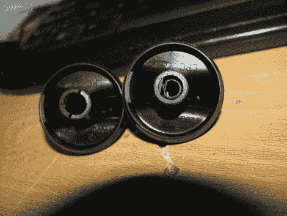

# 简单的加工工艺修复损坏的控制旋钮

> 原文：<https://hackaday.com/2012/01/20/simple-machining-process-repairs-broken-control-knob/>

[弗朗西斯科]正在帮他妈妈修理她的福特 Ranger 的前灯旋钮。上面你可以看到左边坏了的旋钮，右边应该是什么样子的(取自[弗朗西斯科]自己的车作为参考)。我们以前遇到过塑料旋钮上的分裂轴，并认为这是无法修复的。但他没有那么轻易放弃。他提到你可以花几块钱买一个替代品，但是他有办法通过加工金属衬套来修理旋钮。

这个想法是你磨一个金属环，其内径与塑料轴的外径相匹配。通过将损坏的旋钮插入环中，塑料被紧紧地固定在一起，就好像它从未损坏过一样。在休息后的视频中，[Francisco]使用他的垃圾箱中的金属铅笔体和迷你车床将套管切割成一定长度，并按照他的规格铣削内径。

他谈到了在他居住的智利获得替换零件的困难。但是我们认为这种节俭是所有黑客的好榜样。如果你有工具，为什么不用它们呢？如果你没有它们，这里有一个很好的借口来获得它们！

[https://www.youtube.com/embed/AW9H0hJyQbk?version=3&rel=1&showsearch=0&showinfo=1&iv_load_policy=1&fs=1&hl=en-US&autohide=2&wmode=transparent](https://www.youtube.com/embed/AW9H0hJyQbk?version=3&rel=1&showsearch=0&showinfo=1&iv_load_policy=1&fs=1&hl=en-US&autohide=2&wmode=transparent)