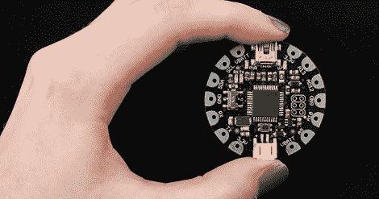

# 一个更好的 Arduino LilyPad

> 原文：<https://hackaday.com/2012/01/21/flora-a-better-arduino-lilypad/>

几个月来，[Ladyada]一直在开发她的可穿戴电子平台 [FLORA](http://www.adafruit.com/blog/2012/01/20/announcing-the-flora-adafruits-wearable-electronics-platform-and-accessories/) 。尽管刚刚宣布了它的规格，但它看起来比之前的山丘女王 [Arduino LilyPad](http://arduino.cc/en/Main/ArduinoBoardLilyPad) 好得多。

查看 FLORA 和 LilyPad 的规格表，我们发现 FLORA 的闪存和 SRAM 是 LilyPad 的两倍。LilyPad 有更多的 I/O 选项，但是[Ladyada]的 FLORA 有一个好处，就是不使用 ISP 头文件进行编程；FLORA 完全兼容 USB。FLORA 的直径也比 LilyPad 小大约四分之一英寸，这是你在进行可穿戴项目时要考虑的因素。

除了蓝牙、GPS、加速度计、指南针和其他为 FLORA 计划的模块(虽然看起来[它们还没有上市](http://www.adafruit.com/category/92))，FLORA 还支持 USB HID，因此它可以作为 USB 键盘、鼠标、MIDI 设备或连接到手机。如果你曾经想要一件开襟羊毛衫，这就是你想要的。

休息之后，请观看[Ladyada]的 LED 布料视频演示。

[https://player.vimeo.com/video/35357226](https://player.vimeo.com/video/35357226)