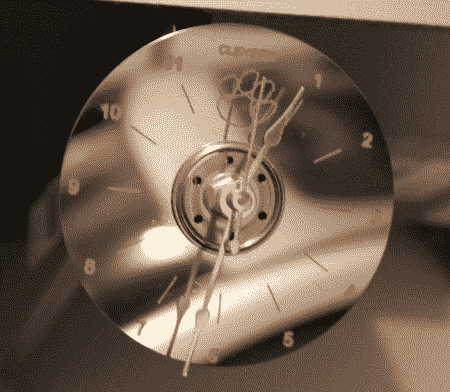

# 废弃的硬盘？为什么不是刻钟？

> 原文：<https://hackaday.com/2012/01/21/trashed-hard-drive-why-not-an-engraved-clock/>

所以你的硬盘坏了。不要绝望，只要做一点小小的工作，你的磁盘就可以变成一个[时钟，如上图](http://www.jcopro.net/2012/01/11/yet-another-hdd-clock-a-clemson-tigers-logo/ "Engraved HDD platter clock Clemson University")所示。经过几次不同的成功迭代，我做了这个钟，包括[的第一次修改](http://www.jcopro.net/2011/10/10/quick-project-how-to-make-a-clock-from-an-old-hard-drive/ "hard drive platter clock")，它只是一个浅盘，中间拧入一个业余爱好商店的时钟套件。这仍然是一个很好的效果，但是如果你想知道现在是什么时间，有这些数字会很有帮助。

为此，你需要某种 CNC 机器(在这个例子中是一个成套制造的路由器)，以及某种生成 Gcode 的方法来正确切割一切。这里的提供了一个关于这个标志如何最终变成机器可以理解的东西的指南[。当然，如果你不确定什么标志会在你的时钟上好看，你可以跳过一些步骤，刻上我们的标志。在这篇](http://www.jcopro.net/2011/12/13/turn-your-favorite-logo-into-a-dxf-for-engraving/ "guide to turn a logo into DXF format")[文章](http://hackaday.com/2010/01/12/how-to-make-a-printable-ces-badge/)中，方便提供。dxf 格式，可以由 CAM(计算机辅助制造)程序转换成您的机器可以理解的代码。

休息之后，请观看使用以下方法雕刻两个“拼盘钟”的视频: <https://www.youtube.com/embed/l9ztyiEMuwo?version=3&rel=1&showsearch=0&showinfo=1&iv_load_policy=1&fs=1&hl=en-US&autohide=2&wmode=transparent>

 </body> </html>