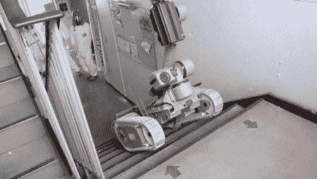

# 福岛机器人日记

> 原文：<https://hackaday.com/2012/01/28/the-fukushima-robot-diaries/>

在福岛的可怕悲剧之后，清理和损害评估已经开始。一个只知道叫[s . h]的机器人操作员决定写一篇关于他们努力的博客。如上图所示，他们正在使用[[iRobot](http://www.irobot.com/gi/ground/510_PackBot/for_Infantry_Troops)型号，包括[510 Packbot]和[710 Warrior]。

自从清理工作开始以来，[S.H.]每天都在他或她的博客上发帖。在这个博客的消息开始通过各种社交媒体渠道传播后，这个博客被神秘地关闭了。该博客有时批评清理工作的一些元素，但不知道为什么会消失。根据[IEEE]的说法，联系[S.H.]的努力没有成功。

幸运的是，在删除之前，[IEEE]的[Erico Guizzo]决定复制这些帖子。这些内容已被翻译成英文，现在可以通过上面列出的链接获得部分内容。休息之后，请务必观看机器人培训视频。

[https://www.youtube.com/embed/PUhCPuDbUjg?version=3&rel=1&showsearch=0&showinfo=1&iv_load_policy=1&fs=1&hl=en-US&autohide=2&wmode=transparent](https://www.youtube.com/embed/PUhCPuDbUjg?version=3&rel=1&showsearch=0&showinfo=1&iv_load_policy=1&fs=1&hl=en-US&autohide=2&wmode=transparent)