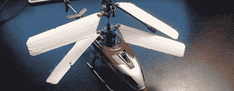

# 3D 打印直升机叶片

> 原文：<https://hackaday.com/2012/01/23/3d-printed-helicopter-blades/>

如果你像我们一样，你已经迷恋上了你在亚马逊上买的小型遥控直升机，直到它从墙上倾斜下来，折断了它的叶片。既然你想知道如何处理那一小堆塑料、金属和电子产品，为什么不在你的 3D 打印机上打印一些直升机叶片呢？

[Taylor]在他的[工具](https://shop.ultimaker.com/)上打印了这些刀片，但我们不明白为什么不能在 Makerbot 或其他 RepRap 上打印。第一套印刷叶片在顶部转子上工作，但当所有四个叶片都被更换时，它们太重了。这些部分是在 [netfabb](http://www.netfabb.com/professional.php) 中使用 0.08 毫米的图层高度编辑的，现在它们完美地工作了。就免费工具而言， [Slic3r](http://slic3r.org/) 是。STL 到 Gcode 的转换，现在[Taylor]把文件放到 Thingiverse 上，任何人都可以打印一套备用刀片。

休息之后，看看[泰勒]将他的打印刀片与他的[牛逼直升机](http://www.amazon.com/gp/product/B004OGBNJ8/)附带的库存刀片进行比较。

 <https://www.youtube.com/embed/qXlUSWrVzys?version=3&rel=1&showsearch=0&showinfo=1&iv_load_policy=1&fs=1&hl=en-US&autohide=2&wmode=transparent>

 </body> </html>