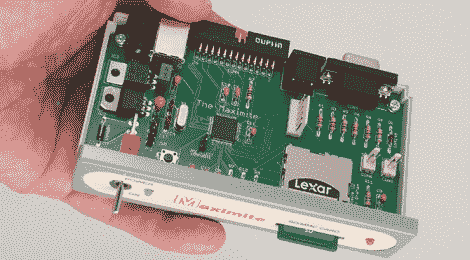

# 最大化可以追溯到基础时代

> 原文：<https://hackaday.com/2012/01/23/maximite-harkens-back-to-the-days-of-basic/>

任何一个自称在 80 年代呆过一段时间的极客都会告诉你，他们过去是如何用 BASIC 将程序输入他们的“微型计算机”的。那是一个简单的时代，那时计算机存在的理由仅仅是作为一个基本的解释器。这些日子已经过去很久了；你不能简单地打开一台电脑，让它加载一个基本的提示。这就是[Geoff]的 [Maximite 单板计算机](http://geoffg.net/maximite.html)的用武之地。这是一个很小的盒子，唯一的用途是玩 BASIC。

[Geoff]为他的 Maximite 的 CPU 使用了具有 128k RAM 的 PIC32MX 微控制器。与苹果[或 TRS-80]不同，BASIC 的 Maximite 版本可以开箱即用地进行浮点运算。为了连接到外部世界，Maximite 有 VGA 或 composite out 来显示基本 interepreter。PS/2 键盘端口提供输入，USB 端口和 SD 卡可用于从 PC 加载和保存程序。

Maximite 包括一个 20 针分线点，可用于你能想象到的任何 IO。这是在[Geoff]的[mini Maximite](http://geoffg.net/mini-maximite.html)上复制的，它被设计成 Arduino 的复古回归。我们认为这些被称为基本邮票，但如果它让孩子们编程，我们会让它滑动。