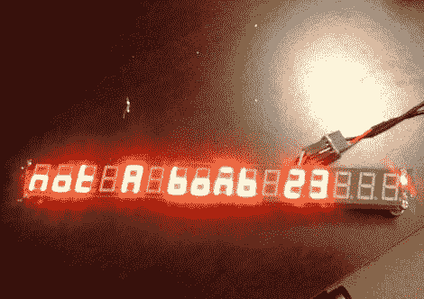

# 简单、独立的 7 段显示器

> 原文：<https://hackaday.com/2012/01/24/a-simple-self-contained-7-segment-display/>

众所周知，七段显示器是传递数据的一种简单而有用的方式，所以[Kelvyn Panici]决定组装一个极简的独立显示器，在家里使用。

显示器本身是他从 DealExtreme 以不到 10 美元的价格买到的 16 位模型。他想找到一个足够小的微控制器来控制显示器，所以他选择了 ATtiny85 来控制它。在一小片 perfboard 上安装了 mcu 之后，他烧了 Arduino bootloader，上传了一个驱动显示器的小草图。

正如你在下面的视频中看到的那样，事情进展得非常顺利，他展示了一个预 perfboard 原型。[Kelvyn]目前没有任何即将使用该显示器的项目，尽管有过多的可能性。我们认为，如果给它装上电池和某种无线电，使它完全独立，它在任何地方都会工作得很好。

 <https://www.youtube.com/embed/D4NZ0nGKdFo?version=3&rel=1&showsearch=0&showinfo=1&iv_load_policy=1&fs=1&hl=en-US&autohide=2&wmode=transparent>

 </body> </html>