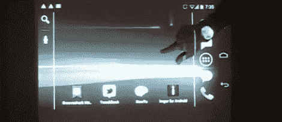

# 用投影仪和 Kinect 控制 Android

> 原文：<https://hackaday.com/2012/01/25/control-android-with-a-projector-and-kinect/>

如果你打算建造一个巨大的触摸屏，为什么不使用一个为触摸界面设计的操作系统，比如 Android？[科林]也有同样的想法，所以他把他的手机连接到投影仪和 Kinect 上。

视频通过 [MHL](http://en.wikipedia.org/wiki/Mobile_High-definition_Link) 连接从【科林】的 Galaxy Nexus 传送到投影仪。不过，让 Kinect 工作起来有点困难。Kinect 连接到运行 [Simple Kinect Touch](http://code.google.com/p/simple-kinect-touch/) 的 PC。PC 将来自 Kinect 的数据转换成 [TUIO 命令](http://www.tuio.org/)，这些命令通过使用 [TUIO for Android](https://github.com/rjmarsan/TuioForAndroid) 接收。

为了让 TUIO 命令被识别为用户输入，[科林]不得不[编译他自己版本的 Android](http://source.android.com/) 。这是一项繁重的工作，但使用一个为触摸界面设计的操作系统似乎比从零开始的[其他](http://hackaday.com/2011/08/31/multitouch-tower-defense-uses-physical-towers/)触摸屏黑客要好得多。

休息之后你可以看看[科林]的演示。可悲的是，没有愤怒的小鸟。

[https://www.youtube.com/embed/BHB2Fwbf-ck?version=3&rel=1&showsearch=0&showinfo=1&iv_load_policy=1&fs=1&hl=en-US&autohide=2&wmode=transparent](https://www.youtube.com/embed/BHB2Fwbf-ck?version=3&rel=1&showsearch=0&showinfo=1&iv_load_policy=1&fs=1&hl=en-US&autohide=2&wmode=transparent)