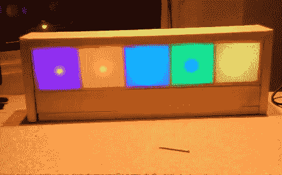

# 非常准确的时钟不能准确读取

> 原文：<https://hackaday.com/2012/01/25/very-accurate-clock-cant-be-read-accurately/>

【马丁】正在展示他的新时钟，他称之为[光谱时钟](http://www.instructables.com/id/Light-Spectrum-Clock/)。我们喜欢看它，在五个正方形中使用 RGB LEDs，让我们想起一些 LED 咖啡桌。从左至右显示星期、日、小时、分钟和秒。简单吧？

当我们浏览他的文章时，我们不得不笑了笑。他选择了 Arduino nano 作为控制器，使用 TLC5940 芯片来驱动 led。但我们觉得有趣的是包含了一个 DS1307 实时时钟。它将保持相当准确的时间(不如 DS3232 那么好，但仍然令人满意),但模糊显示技术使得准确地告诉时间是不可能的。但是像[其他基于颜色的时钟](http://hackaday.com/2010/06/07/color-clock-makes-telling-time-impossible/)一样，这也是乐趣的一部分。使用 RTC 芯片的真正原因是，它们通常包括电池供电的操作，这样当你不在时，你可以关闭 led，时钟将继续滴答作响。

休息之后，您可以在剪辑中看到时间一秒一秒地消逝。

 <https://www.youtube.com/embed/C92FkK1RlwM?version=3&rel=1&showsearch=0&showinfo=1&iv_load_policy=1&fs=1&hl=en-US&autohide=2&wmode=transparent>

 </body> </html>