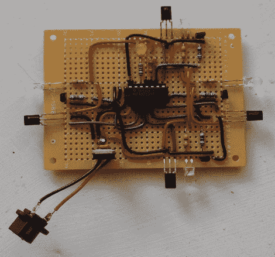

# 干扰远程直升机

> 原文：<https://hackaday.com/2012/01/26/jam-a-remote-helicopter/>

司马 S107 IR 是一种流行的小型遥控直升机。当[迈克尔]的一个朋友开始在办公室里飞行时，他决定试着干扰信号，创造一个禁飞区。幸运的是，网上的一些[人](http://www.avergottini.com/2011/05/arduino-helicopter-infrared-controller.html)已经[破译了飞行威胁使用的红外信号](http://blog.tomg.co/post/13117704855/syma-107-arduino-helicopter-part-one)。从那里，快速浏览 Mouser 以获得一些 led，并为 TI MSP430 快速编写一些代码是唯一剩下的工作。

微控制器上的软件设置为广播“起飞”信号，但[迈克尔]承认他不能 100%确定直升机是否真的收到了信号，或者禁飞区的信号是否与遥控器的信号混合，导致接收到垃圾信号。不管怎样，当直升机进入禁飞区时，它会从空中降落。

然而事情并不完美，高估 MSP 的当前能力导致微控制器重置并使调试器崩溃。但是一个简单的信号发送方式的重新安排很快解决了这个问题。

休息之后，请加入我们，观看一段简短的视频。

[https://www.youtube.com/embed/EgWysh5yhGg?version=3&rel=1&showsearch=0&showinfo=1&iv_load_policy=1&fs=1&hl=en-US&autohide=2&wmode=transparent](https://www.youtube.com/embed/EgWysh5yhGg?version=3&rel=1&showsearch=0&showinfo=1&iv_load_policy=1&fs=1&hl=en-US&autohide=2&wmode=transparent)