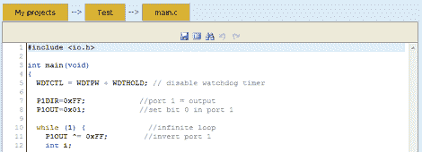

# 通过互联网对微控制器编程

> 原文：<https://hackaday.com/2012/01/26/program-a-microcontroller-over-the-internet/>

如果你曾经想在“云中”编写微控制器，你可能想去 [Inventor Town](http://www.inventortown.com/) ，这是一个在线 IDE，允许你为 MSP430 系列微控制器编写和编译固件。

使用您的 Google 帐户登录后，您会看到一个“我的项目”页面。从那里，您可以为 MSP430x2231 或 x2211 微控制器开发尽可能多的项目。在线编辑器有重要的关键词突出显示功能，但遗憾的是没有很多更高级的文本编辑器功能，比如红色下划线语法错误。写完代码后，按下 compile 按钮，下载。十六进制文件并上传到您的板。

我们很惊讶以前没见过这样的东西。对我们来说，这似乎是 github 风格的微控制器代码共享网站的理想基础。任何有事业心的 ATtiny 粉丝都想尝试一下吗？

感谢[Rob]发送这封邮件。