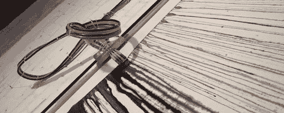

# [杰森·布拉克]现在是一个机器人

> 原文：<https://hackaday.com/2012/01/27/jackson-pollock-is-now-a-robot/>

即使抽象表现主义在几十年前就消失了，机器人仍然在冰冷冷漠的画布上滴着虚无主义的颜料。[Liat]和[Assaf]创造了一个名为 Originals Factory 的机器人，以抽象表现主义的风格创作绘画，这种绘画风格可以说是以[杰森·布拉克]和他的“滴画”为代表

这个构建出奇的简单——有四个装满 C、M、Y 和 K 颜料的容器。泵将这些颜料输送到安装在帆布上方铝轨上的打印头。构建的软件部分相当有趣。代替像素，图像被渲染成“像素”——特定长度和颜色的垂直线。尽管我们没有看到任何更精确工作的例子，[Liat]告诉我们 Originals Factory 可以用来在画布上绘制图形。

休息之后，看看 Originals 工厂将颜料喷到画布上的视频。

[https://www.youtube.com/embed/-OuaBr8Rn8c?version=3&rel=1&showsearch=0&showinfo=1&iv_load_policy=1&fs=1&hl=en-US&autohide=2&wmode=transparent](https://www.youtube.com/embed/-OuaBr8Rn8c?version=3&rel=1&showsearch=0&showinfo=1&iv_load_policy=1&fs=1&hl=en-US&autohide=2&wmode=transparent)