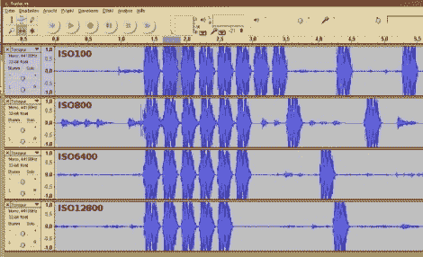

# 用音频编辑软件测量 DSLR 性能

> 原文：<https://hackaday.com/2012/01/27/dslr-performance-measured-with-audio-editing-software/>

[雅罗斯拉夫的]相机没有测量不同模式下响应速度的功能，所以他想出了自己的方法。他使用网络摄像头上的麦克风记录了镜子和快门移动发出的声音，然后[使用 Audacity 分析相机的性能](http://wordpress.crazylab.de/2012/measuring-the-performance-of-dslr-cameras-and-why-the-iso-setting-could-impact-the-burst-length/)。

当你认真对待它的时候，这是一个奇妙的想法。Audacity 是一个开源音频编辑套件，它能够将每个捕获的音频轨道一个接一个地显示出来。这使您可以轻松精确地对齐剪辑，并具有内置的时间测量功能，分辨率非常高。

他在佳能 EOS600D DSLR 相机上测试了一系列不同的设置。在上图中，你可以看到他在比较不同 ISO 设置的性能。他还研究了不同品牌和大小的 SD 存储卡，以及存储原始图像数据和 JPEG 编码数据时的时间差。