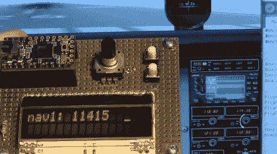

# 为您的飞行模拟器提供简单的触觉控制和显示

> 原文：<https://hackaday.com/2012/01/30/easy-tactile-controls-and-displays-for-your-flight-simulator/>

如果你一直在考虑为你的飞行模拟器添加一些触觉控制和读数，这个指南应该会给你开始这个项目的动力。[Paul]解释如何[构建控件并将它们连接到模拟器数据](http://www.mycockpit.org/forums/showthread.php/24055-Teensy-Low-Cost-Interfacing-Using-Arduino?p=128101#post128101)。他让它看起来很简单，感谢他代码中的接口示例，事实上的确如此。

这里他用一块小小的控制板建造了硬件。控制器通过 USB 通信，软件是跨平台的。他正在控制 X 平面模拟器的航向信息，使用旋转编码器进行微调，使用按钮以 100 为增量。但他并没有就此止步。他正在研究一种自动油门设计，这种设计使用伺服电机来移动油门杆。电位器可以用来改变油门，伺服映射到该旋钮的位置。但它是双向的，拖动屏幕上的虚拟油门也会这样做。

这是让飞行模拟器变得更有趣的一种方法，而不需要花费你家里的整个房间。休息之后，不要错过[Paul]精彩的演示视频。

[https://www.youtube.com/embed/gVZtq7NBJOo?version=3&rel=1&showsearch=0&showinfo=1&iv_load_policy=1&fs=1&hl=en-US&autohide=2&wmode=transparent](https://www.youtube.com/embed/gVZtq7NBJOo?version=3&rel=1&showsearch=0&showinfo=1&iv_load_policy=1&fs=1&hl=en-US&autohide=2&wmode=transparent)

[谢谢致命的爸爸]