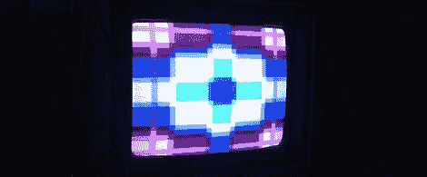

# 为 Chiptune 表演增添视觉效果

> 原文：<https://hackaday.com/2012/01/30/adding-visuals-to-chiptune-performances/>

如果你从来没有去过 chiptune 表演——是的，他们确实存在——你会注意到表演者背后令人敬畏的视觉效果，这些表演通常与浮华的 NES 一起展示。如果这是一个真正的好节目，8 位的可视化将与音乐同步，实际上可能作为一个 lo-fi 频谱分析仪。[Andy]为 Sega Genesis 或 Megadrive 设计了自己的可视化系统。16 位落后于他的建设，我们会说，如果远远超过卑微的 NES。

为了他的可视化，[Andy]将音频输入 ATMega328 和一直受欢迎的 [MSGEQ7](http://www.sparkfun.com/products/10024) 七波段图形均衡器 ic。均衡器的输出直接进入 Sega Nomad [Andy]的第二个控制器输入，该控制器为他的节目运行定制的 rom。ROM 与微控制器项目一起编程，作为他演出的频谱分析仪。

休息之后，你可以用丹尼尔·卡农的音乐来看看安迪的想象。我们更喜欢以 [An0vA](http://an0va.bandcamp.com/album/the-teaching-machine) 和微控制器代码为特色的演示，但它仍然是一个非常好的演示。

 <https://www.youtube.com/embed/41_Pr1iDhsY?version=3&rel=1&showsearch=0&showinfo=1&iv_load_policy=1&fs=1&hl=en-US&autohide=2&wmode=transparent>

 </body> </html>