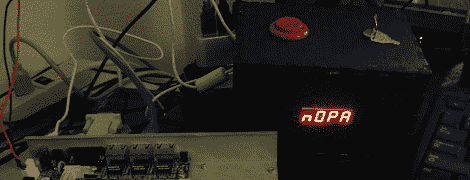

# 我们仍然不能落后的 SOPA

> 原文：<https://hackaday.com/2012/01/30/a-sopa-we-still-cant-get-behind/>

[Brad]1 月 18 日收获颇丰。考虑到有多少网站为了抗议 SOPA 而关闭，我们不能责怪他。在考虑如果流行的互联网时间接收器被命令关闭，他可以做什么时，[Brad]想到了[停止在线生产力避免框](http://www.lvl1.org/2012/01/29/a-sopa-you-can-get-behind/)。这个版本会将所有流量重定向到 reddit、hacker news 和(gasp！)花一天时间浏览一个简单的网页，问一个永恒的问题:“你现在不是应该在工作吗？”

这个盒子有两种模式:在 SOPA 模式下，整个互联网都在布拉德的指尖。在 NOPA 模式下，Arduino 与路由器上运行的 Python 脚本通信，以调出互联网黑名单。一个简单的按钮太容易被超越，所以有一个“核模式”，关闭这些时间汇一个小时。绕过黑名单的唯一方法是重启路由器，这个过程需要 15 分钟，并且会在此期间关闭整个互联网。如果你有点无聊，这可不是你想做的事。

SOPA 盒子的所有代码都在 github 上，休息之后你可以看看布拉德的 SOPA 盒子演示。

 <https://www.youtube.com/embed/rncAj876od0?version=3&rel=1&showsearch=0&showinfo=1&iv_load_policy=1&fs=1&hl=en-US&autohide=2&wmode=transparent>

 </body> </html>