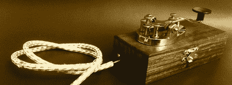

# 电报键是一个奇妙的 Twitter 输入

> 原文：<https://hackaday.com/2012/01/31/telegraph-key-makes-for-a-fantastic-twitter-input/>

为了界面考古学的利益，[马丁]提交了一个电报密钥，一个使用莫尔斯电码发布到推特上的电报密钥。这是一个奇妙的建筑，看起来几乎像是 20 世纪的东西。

这些年来，我们已经看到了大量的莫尔斯键盘，但从来没有一个设计得如此完美，只为一个目的。Tworse Key 的核心和大脑是通过 API 连接 Twitter 的 Arduino 以太网。Tworse Key 自动将所有的[莫尔斯信息](http://twitter.com/tworsekey)发布到 Twitter 上。在过去的 24 小时里，Tworse 键可能已经从桌子上掉了几次，但我们确实看到了一些有目的的信息，如“sos”和[Bell]的[首选电话问候](http://en.wiktionary.org/wiki/ahoy-hoy)。

我们可以说，没有人再使用直接的电报键了，但是除了一些铁杆 CW 业余无线电爱好者，没有人再使用*莫尔斯*了。不过，这并不意味着可以用作日常输入设备。这更像是一次界面考古学的练习**。**也就是说，一个[抑扬格键](http://en.wikipedia.org/wiki/Telegraph_key#Iambic_.28dual-lever.29_Paddles)会是一个更符合人体工程学的解决方案。休息之后请看 Tworse Key 的视频。

 <https://www.youtube.com/embed/V9KckRf_MKo?version=3&rel=1&showsearch=0&showinfo=1&iv_load_policy=1&fs=1&hl=en-US&autohide=2&wmode=transparent>

 
[Martin]布包以太网电缆获得加分。有人知道消息来源吗？
 </body> </html>