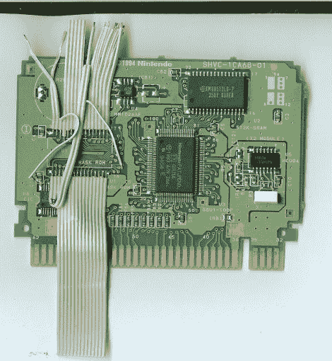

# 超频 Starfox 游戏卡带

> 原文：<https://hackaday.com/2012/01/31/overclocking-a-starfox-game-cartridge/>

我们的一些年轻读者以前从未经历过这种情况，但在过去，如果屏幕上有太多移动的物体，你的视频游戏就会变慢。最初的恶魔城浮现在脑海中，但许多人会在玩奇妙的三维超级任天堂游戏 Starfox 时想起这个问题。[Drakon]再也不能忍受硬件的不足，他[破解了这个卡盒，使其以 42 MHz](http://consolemods.forumotion.ca/t32-starfox-overclocked#38)的速度运行，是设计规格的两倍。

我们只是偶尔看看 cart hacking 场景，所以在这个硬件中使用三个不同版本的 pin 兼容芯片对我们来说是新闻。前两个遭受减速问题，但最终修订版(SuperFX GSU 2)没有。它也可以超频高达 48 MHz，但由于视频帧速率，你不会看到额外的 6 MHz 的额外改善。

[Drakon]使用了一个厄运卡带作为试验品，因为它提供了最多的 RAM，并开始将 ROM 芯片的轨迹重新路由到 EEPROM，以便硬件可以用于不同的游戏。他还借此机会接入了更快的时钟信号。