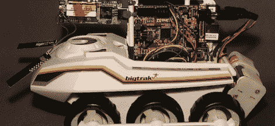

# 把大鳄鱼变成乌龟

> 原文：<https://hackaday.com/2012/01/31/turning-the-big-trak-into-a-turtle/>

80 年代的孩子可能还记得 Big Trak，这是一个六轮可编程玩具，旨在探索客厅另一侧的遥远星球和广阔的两车车库。几年前，Big Trak 重新发布，[Nathan]对这个改进版本非常感兴趣。他是如此着迷，以至于他决定[升级它来支持 LOGO 编程语言。](http://www.nathandumont.com/node/248)

30 年前的 Big Trak 有一个薄膜键盘，可以存储和运行“向前行驶 5 个单位”和“转向 90 度”等命令。这与带有海龟图形的[徽标编程语言](http://en.wikipedia.org/wiki/Logo_(programming_language))非常相似，与[漫游器徽标机器人](http://www.valiant-technology.com/us/pages/roamer_home.php?cat=1&1)几乎相同。

为了控制这辆大卡车，[内森]将电子设备升级为一个芯片套件 Uno 和一个[猎兔犬骨](http://beagleboard.org/bone)。一个用 Python 写的 [LOGO 解释器](http://www.nathandumont.com/node/253)上传到 BeagleBone。在此之后，[内森]几乎被设置。他确实增加了一个 [WiFi 接口](http://www.nathandumont.com/node/254)来无线控制他的大 Trak，我们认为这是一个很好的触摸。

你可以看看[Nathan]的 20 分钟的构建视频，在视频中他讲述了休息后升级他的大 Trak 的整个过程。

[https://www.youtube.com/embed/WQwtnZ-aMNA?version=3&rel=1&showsearch=0&showinfo=1&iv_load_policy=1&fs=1&hl=en-US&autohide=2&wmode=transparent](https://www.youtube.com/embed/WQwtnZ-aMNA?version=3&rel=1&showsearch=0&showinfo=1&iv_load_policy=1&fs=1&hl=en-US&autohide=2&wmode=transparent)