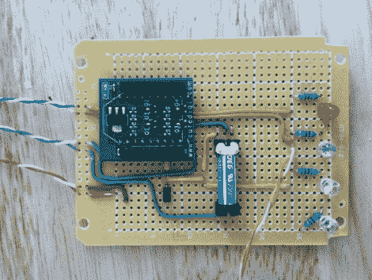

# WiFi 车库门开门器让忘记带钥匙成为过去

> 原文：<https://hackaday.com/2012/01/31/wifi-garage-door-opener-makes-forgotten-keys-a-thing-of-the-past/>

[托德]的女儿有忘记带房子钥匙的习惯，所以他在寻找一种方法，在必要时让进入房子变得更容易。他过去曾尝试过无线车库门键盘，但它们的性能充其量也就一般。在搜索了商业解决方案的市场和查看了[其他黑客](http://hackaday.com/tag/garage-door/)的作品后，他决定他需要制定一个自己的定制解决方案。

他开始四处购买支持无线功能的微控制器，并选定了一个漫游网络 RN-XV 模块，该模块旨在作为 XBee 的替代产品。RN-XV 配有 5v 至 3.3v 的电源适配器，几乎是他将 iPhone 与车库开门器连接所需的一切。

微控制器有足够的 GPIO 引脚来控制车库门，同时还使用简单的磁铁/簧片开关组合来监控门的状态。[托德]家中的网络服务器从连接到他的无线局域网的任何电话接收输入，并将打开/关闭命令转发给开启器。开启者又通过网络接口向他返回状态消息。

我们真的很喜欢这个系统简洁的设计，而且只要[Tod]在家里已经[关闭了 WPS](http://hackaday.com/2011/12/29/a-chink-in-the-armor-of-wpawpa2-wifi-security/)，他真的不应该太担心未经授权的进入。