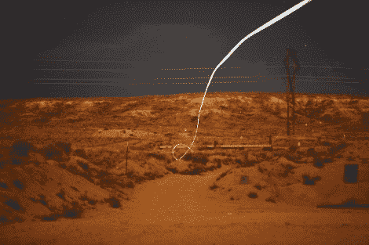

# 上个世纪的导弹为这种制导子弹让路

> 原文：<https://hackaday.com/2012/02/01/last-centurys-guided-missile-steps-aside-for-this-guided-bullet/>

这是子弹射向目标的图像。有几件事需要注意。首先，这不是一发曳光弹，炮弹实际上有一个 LED，它在长时间(相对于子弹速度)曝光中被发现。第二个——也是最明显的——要考虑的是它实现目标的非线性路径。那是因为[这是激光制导子弹](https://share.sandia.gov/news/resources/news_releases/bullet/)。

智能子弹大约 4 英寸长，带有一个光传感器，8 位处理器和一些电磁致动器。这个尖端正在寻找一个激光绘制的目标，用一种算法计算沿途的航向修正，并使用致动器移动鳍来改变它的路径。对我们来说，最有趣的部分是，这种弹药需要一个非膛线桶。膛线使子弹在离开枪支时旋转，这通常会导致更直和更可靠的路径。但是如果它在旋转，微控制器就不能可靠地控制方向。

我们敢打赌，在我们在战场上听说它之前，它最终会成为视频游戏中的一种特殊狙击工具。检查一个像飞镖一样的子弹在休息后离开枪口的剪辑。

 <https://www.youtube.com/embed/KLwVVYV3_K4?version=3&rel=1&showsearch=0&showinfo=1&iv_load_policy=1&fs=1&hl=en-US&autohide=2&wmode=transparent>

 
[谢谢达斯蔻驰]
 </body> </html>