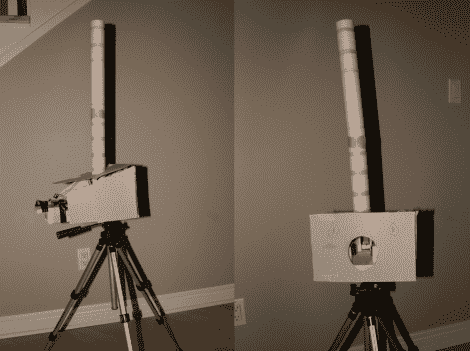

# 快速射击，遥控乒乓球炮塔

> 原文：<https://hackaday.com/2012/02/02/rapid-fire-remote-controlled-ping-pong-ball-turret/>

[Andrew]和他的兄弟有一些时间(和许多乒乓球),所以他们决定找点乐子，建造了一个遥控乒乓球塔。

撇开 Arduino 不谈，正如[Andrew 的]文章解释的那样，这个炮塔既便宜又容易建造。发射机制是使用一对泡沫轮和电机构建的，用于发射乒乓球，就像棒球投球机一样。这些球储存在轮子上方的一个硬纸板管中，当被触发时由一个机械挡板释放。

当[安德鲁]准备好释放炮塔的有效载荷时，他通过 VNC 向他的电脑发送命令，电脑通过串行连接将命令转发给 Arduino，触发襟翼。虽然控制方案肯定会受益于直接的无线电话到 Arduino 通信，但它似乎足以满足(安德鲁的)需求。

看看下面的视频，看看[Andrew]在跳跃后用乒乓球给他的哥哥一个“惊喜”。

 <https://www.youtube.com/embed/QR5ErY772eM?version=3&rel=1&showsearch=0&showinfo=1&iv_load_policy=1&fs=1&hl=en-US&autohide=2&wmode=transparent>

 </body> </html>