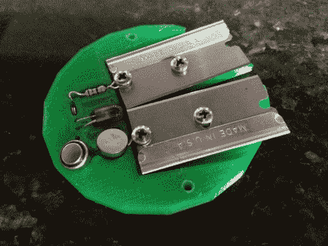

# 当您碰到导体时，可印刷的剥线钳会亮起

> 原文：<https://hackaday.com/2012/02/03/printable-wire-stripper-lights-up-when-you-hit-the-conductor/>

不再为剥去像带状电缆中使用的细导线的绝缘层而苦恼。多年来，我们一直使用刀片来做这件事，因为最小的电线在我们可靠的剥线器上没有插槽。但这样做时，我们通常会切穿导体(或许多股线)。[Bjbsquared]想出了[这个设计，当你撞到售票员](http://www.thingiverse.com/thing:16332)时，它会提醒你。

它使用两个金属刀片作为 LED 电路中的电极。当任何金属连接两者时，LED 将被点亮。这样你就知道你已经切得够远了，应该能把电线的绝缘层扯下来。这张图片只显示了印刷单元的一半，第二块覆盖了内部工作，并有助于防止手指偏离刀片的边缘。

过度杀戮？我们不这么认为，我们希望每个人都同意这是一个很棒的设计。

[通过 [Reddit](http://www.reddit.com/r/DIY/comments/p66db/wire_stripper_lights_up_when_youve_cut_deep_enough/) 和 [Gizmodo](http://gizmodo.com/5881214/brilliant-wire-stripper-lights-up-when-youve-cut-deep-enough)