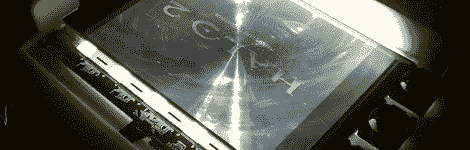

# 将透明胶片转换为 LCD 监视器

> 原文：<https://hackaday.com/2012/02/04/converting-transparency-sheets-to-an-lcd-monitor/>

很明显，这个周末有某种体育赛事正在电视上播放，这在历史上被用作购买大屏幕电视的借口。[Joel]想要一台便宜的大屏幕电视，所以他[把一台高射投影仪](http://hackedpotatoes.com/2012/02/overhead-to-lcd-video-projector-conversion/#more-296)改装成可以在他的 XBox 上使用的东西。

在高射投影仪上使用裸露的 LCD 面板是一个几十年前的老问题，我们在 T1 之前已经讨论过了。基本的想法很简单，但是我们从来没有见过任何可以被认为是半永久性的建筑。[Joel]开始了他的项目，他花了 25 美元买了一台多余的高射投影仪，并找了一块砧板来安装 LCD。投影仪中的灯泡增加了大量热量，因此使用三个小风扇在投影仪玻璃和 LCD 显示器之间吹风。

[Joel]开始关注 LumenLab DIY 投影仪项目，但认为这是一个可怕的工作量，初始投资相当高。如果不算[Joel]在建造他的项目时烧毁的几块液晶显示器，他的投影仪造价不到 100 美元。我们很喜欢这个结果，并且确信它会在[Joel]的 LAN 派对上大受欢迎。